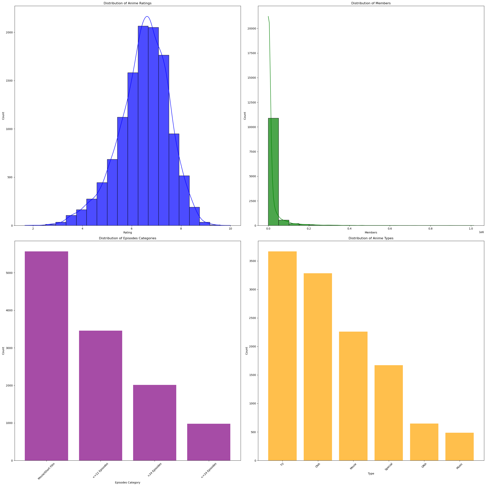
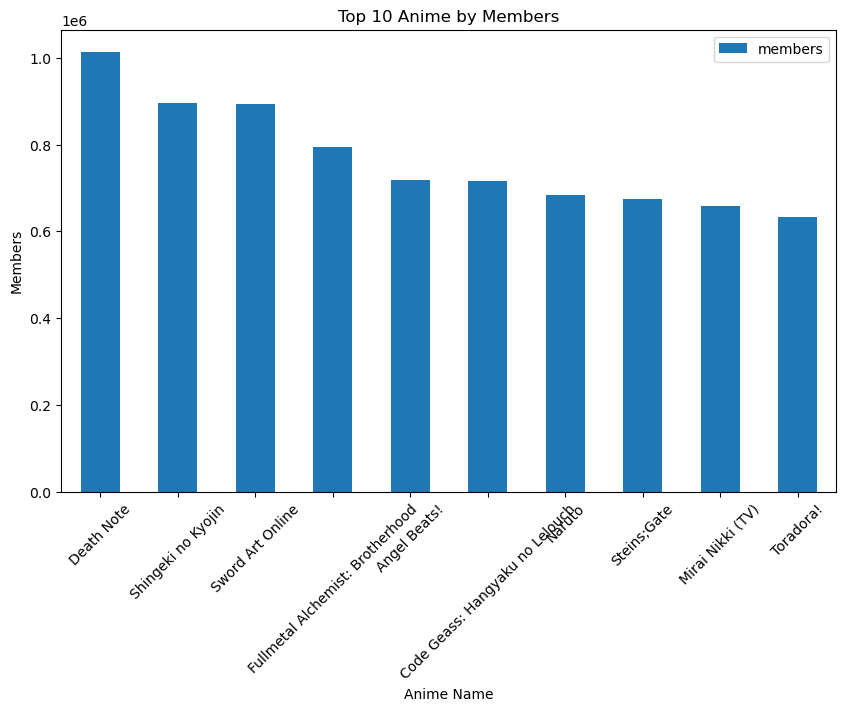

## Anime Recommendation System
=======================
Matt Carey, Kai Hansen, Paula M-Bailey, Steve Njoroge, and Mohammed Qurneh

## **Introduction**

With humble beginning that trace to late 19th century Japan, Anime has become global phenomenon captivating audiences.  As the number of titles grows, discovering new titles can be overwhelming.  This is where an anime recommender system can be beneficial.  

Our aim is to design a system to enhance the user’s experience by suggesting relevant shows and movies based on their taste and behavior patterns.  By analyzing viewer history, ratings, and behavior, we can identify patterns and similarities that could lead users to new titles. 

In this project, we focused on  building a content-based recommendation system. This system generates suggestions based on content that another user has previously enjoyed.  By using cosine similarity, we can compare features and identify those that match a user's interest and taste.  The goal is to create a way for users to discover new anime.  To evaluate the success of our recommendation system, we will test it out with members of our team and classmates.

## **What is a Recommendation System?**

A recommendation system is an algorithm designed to suggest relevant products to a user based on the user’s behaviors, similarities with another user, and interests.  Products can include books, music, videos, travel destinations, friends and connections, etc.

## **The Data**
This project contains two datasets, one with the anime rating and the other with information escribing the anime itslef.  Both datasets is located here. **Link is Weird includes Kai repo**  from Kaggle.

User data contains 7.8 million entries of user ratings.

Includes:
- user id 
- anime title  
- rating

Anime Data contains 12,200 entries describing anime shows and movies.

Includes:
- The title of the anime.
- The associated genres (e.g., action, comedy, drama).
- Whether it’s a TV show or a movie.
- The number of episodes.
- The overall average rating and popularity based on how many users rated it.

## **Pre-Processing**

## **Modeling**
### Cosine Similarity

It begins with access to user data. Next, a content-based matrix is created based on the viewed anime titles and their ratings. A weighted feature matrix is computed using the user's matrix and the matrix containing all titles. This weighted features matrix is calculated using a similarity algorithm like cosine similarity, which determines how similar two vectors are to one another. The formula is as follows:

<html>
<head>
  
</head>
<body>

Cosine Similarity \( x, y = \frac{x \cdot y}{||x|| \cdot ||y||} \)

where:

<ul>
  <li> \( x \cdot y \) is the dot product of vectors \( x \) and \( y \)</li>
  <li> \( ||x|| \) is the magnitude (norm) of vector \( x \)</li>
  <li> \( ||y|| \) is the magnitude (norm) of vector \( y \)</li>
</ul>

</body>
</html>

It measures the cosine of the angle between the vectors and produces a value between -1 and 1. A value of 1 suggests that 𝑥 and 𝑦 are very similar in tastes. A value of 0 suggests that 𝑥 and 𝑦 don’t share any interests, while a value of -1 suggests that 𝑥 and 𝑦 have opposite interests.

### Feature Selection

## **Evaluation**

## **Impacts**
An anime recommendation system can have a positive and negative impact on the user.  Of course, personalizing recommendations for users can enhance their viewing experience.   By introducing users to new titles,  we are stimulating interest in the genre which may have the ability to drive sales of merchandise and streaming subscriptions.  In addition, these sales can provide financial support to small studios that may struggle with visibility in the ever-growing market.

On the negative side, an effective recommendation system can increase screen time for users which can lead to social isolation and addictive behavior, according to some studies.  Lastly, depending on the system created, we may invertedly provide users with the same type or style of anime rather than the intended new and lesser-known titles.

## **Conclusion**
From our recommendery system, we see that we were able to successfully create a system that can highlight potential pieces of anime for a viewer. To test this out, it would be good to actually look at the recommended pieces of anime this system would give for you individually, and see if you like its recommendations. There were some issues though with the system, which we believe come from the data. The coverage of anime pieces and diversity of recommendations was not as high as one may like. This could be for a large range of factors, but based on the visualization, we can paint a picture why. When looking at our recommendations, we saw high amounts of products that contained genres with action, comedy, adventure, drama, and fantasy. Yet is saw very small representation in genres such as cars, vampires, and super powers. By having such large and potentially over-represented pieces, our system forms a bias against these other pieces, especially when ratings are factored in. Now, this could be normal as well. Its possible that the anime community as a whole does not value those latter genres. To make the recommender system more accurate and potentially cover more pieces, it would be good to collect larger datasets with wider range of genres covered, for the system to get a better understanding. But playing the other side of the coin, it could also be possible that are system is catching a trend in what genres people enjoy viewing, and signal what genres should potentially not be created in high demand.